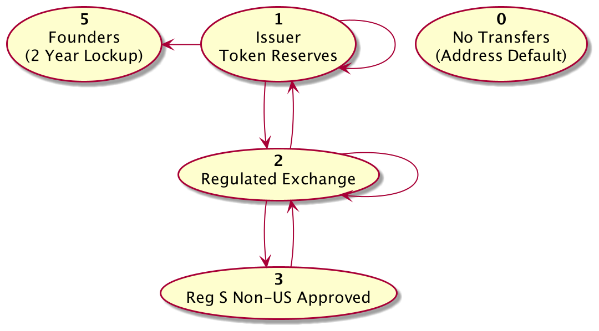
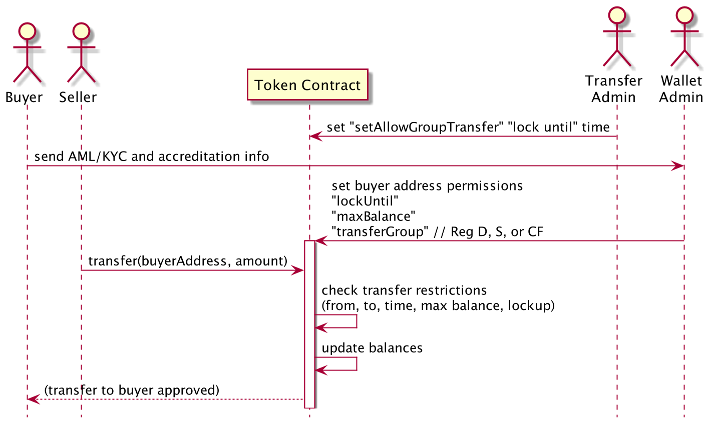

# Algorand Security Token

This is an Open Source Algorand security token compatible with CoMakery. Although it is built on Algorand it is influenced by the Ethereum ERC-1404 security token standard. 

The contract is written as a Python [PyTeal](https://github.com/algorand/pyteal) script that generates an Algorand TEAL Smart Contract.

This token is modeled on the [CoMakery Security Token specification](https://github.com/CoMakery/comakery-security-token). An Algorand TEAL version was adapted from the CoMakery Security Token spec by [Derek Leung](https://github.com/derbear) at [Algorand Foundation](https://algorand.foundation/) in Racket with sTEAL. This codebase is the PyTeal rewrite of Derek's work by Jason Paulos with additional modifications by Noah Thorp and the CoMakery Team.

__Although we hope this code is useful to you, it comes with no warranty of any kind. Do your own security audit and legal review.__

## Installation
* `git clone` this Algorand Security Token repository
* Install node.js from [Nodejs.org](https://nodejs.org)
* Follow the Algorand blockchain node [setup instructions](https://developer.algorand.org/docs/run-a-node/setup/install/). You will need this to run tests and scripts. You will know it's installed if you get the help info when you run `goal -h` from the command line.
* Install Python 3 and [pyteal](https://developer.algorand.org/docs/features/asc1/teal/pyteal/)
* Get a purestake.com API key to deploy to testnet / mainnet using hosted nodes
* `cp .env.example .env` and enter your environment variables
* If you want to run a local node that syncs with testnet try https://github.com/algorand/sandbox - it will sync to testnet in minutes instead of days.

From the root directory of this code repository run
```bash
yarn install
```

## Key Files

* The `security_token.py` file compiles into two TEAL Files which are what is deployed to the Algorand blockchain
* `security_token_approval.teal` is the main smart contract application code
* `security_token_clear_state.teal` is a smaller file that cleans up memory if the app is uninstalled from the blockchain
* There are some useful javascript functions in `lib`
* Scripts for deploying and managing the contract are in `bin`
* The jest test suite is in the `tests` folder

## Running Tests
From the root of this repository run
```bash
yarn test
```
This starts a local private Algorand test network and runs automated tests. Then it shuts down the private network.

The tests are written in Javascript using the Jest testing framework.

## Guided Script Tour

Here's a good way to get acquanted with the contracts and scripts...

#### Start the private test network
```
bin/start-devnet.sh
```

Copy one of the generated online addresses that will look like `FQVRXH3NO3W2RHGHRDTXCL5IDZKSLEXINFNBF4GB7R3GCXNK4S4ZXFGRJY`

#### Deploy the contract to the local network from your generated address:
```
bin/deploy-security-token.sh FQVRXH3NO3W2RHGHRDTXCL5IDZKSLEXINFNBF4GB7R3GCXNK4S4ZXFGRJY
```

Note that this script is for local deployment and not intended for deploying to testnet or mainnet. It will recompile the teal contracts by running `python security_token.py` which is a useful development feedback loop if you are developing the contract.

After you deploy make note of the deployment info that should look something like this:
```
Transaction 2XLM7Q3ORY7SN5M36M3334X6MKGFZ3GR2C3VO4TFCOUPMYQGLPMA still pending as of round 133
Transaction 2XLM7Q3ORY7SN5M36M3334X6MKGFZ3GR2C3VO4TFCOUPMYQGLPMA committed in round 135
Created app with app index 1
```

Make note of the app index... in the example above it is `1`.

#### Check the global state of the contract

Get the global state of the contract with
```
goal app read --global --app-id 1 -d devnet/Primary/
```

Get the local state for a specific account with
```
goal app read --local --app-id 1 --from FQVRXH3NO3W2RHGHRDTXCL5IDZKSLEXINFNBF4GB7R3GCXNK4S4ZXFGRJY -d devnet/Primary/
```

#### Shut down the private test network 

```
bin/stop-devnet.sh
```

Note: When it you rerun `bin/start-devnet.sh` it will **reset all data** including the wallet addresses.

## Troubleshooting

#### Developer API & TEAL Compilation: `"EnableDeveloperAPI": true`
If during TEAL compilation javascript tests are failing to compile the contract or complain that there's no Algorand API endpoint, make sure that there is a `config.json` file in the data directory (e.g. `devnet/Primary/config.json`) that turns on the developer tools with the setting `"EnableDeveloperAPI": true`. The `bin/start-devnet.sh` script should create a new private network in the data directory called `devnet` and copy in the config/config.json with the right settings.

#### Javascript Argument Buffer Encodings
When you compile the contract from Javascript you need to encode all of the parameters. 
For example you may need to do something like the following to encode arguments in Javascript before passing them to the API. 
```
let enc = new TextEncoder()
let symbol = enc.encode("ABCTEST")
appArgs.push(symbol)
```

Note that you may also need to avoid overloading Javscript integer size by using a BigInt. An encoding step would still be necessery even with a small integer. Both cases are made easier with the `lib/algoUtils.js` `bigIntToUint8Array()` function.

```
let cap = this.bigIntToUint8Array('8' + '0'.repeat(16))
appArgs.push(cap)
```

Some of these rounding errors may show up in the TEAL Javascript SDK because JSON.parse doesn't handle big integers well.
If you run into weird rounding errors, try to eliminate as many intermediary libraries as possible. For example use `goal` from the terminal if you can.

## "Bad Request": maximum number of applications per account

The maximum applications you may have associated with your account is 10. If you try to install an 11th application you will get a `Bad Request` error.

There are lots of other reasons you may get a bad request error, such as TEAL execution safely exiting because of access control assertions.

## Confusion about Txn.accounts[n], Txn.sender(), Txn.accounts.length() and tealdbg values

There are a few interrelated account reference quirks to keep in mind:
* `Txn.accounts[0]` will always evaluate to `Txn.sender()`
* `Txn.accounts[1]` is the first `--app-account` item. 
* If no `--app-account` items are included, `Txn.accounts.length()` will be 0 but `Txn.accounts[0]` still resolves to the sender.
* `Txn.accounts[n]` for n > 0 will evaluate to the element at the n-1th index of the `--app-account` or `ForeignAccounts` transaction field. For example `Txn.accounts[2]` would refer to `appAccount[1]`. Another way to put it is the `--from` address is shifted into Txn.accounts[0] and `--app-accounts` are shifted right by 1 position.
* Some versions of `tealdbg` show the `Txn.accounts` array incorrectly. If n accounts are present in the transaction’s `ForeignAccounts` array, the debugger will show the sender’s account following by the first n-1 elements from `ForeignAccounts`.

## Teal contract size

The maximum size of the compiled teal contract is 1000 bytes.

On Mac OS you can check the file size by running:
```
python security_token.py && goal clerk compile security_token_approval.teal && stat -f%z security_token_approval.teal.tok
```

# Use Cases

## Issuer Transfer Restrictions
The Algorand Security Token can be configured after deployment to enforce transfer restrictions such as the ones shown in the diagram below. Each holders blockchain wallet address corresponds to a specific category. Only transfers between blockchain wallet address groups in the direction of the arrows are allowed:



## Basic Transfer Restrictions Between Buyer and Seller Accounts




The Transfer Admin role and Wallet Admin role for the Token Contract can provision account addresses to transfer and receive tokens under certain conditions. 

The Wallet Admin sets blockchain address permissions including the group, max token balance, address lock until date and if the address is frozen. 

The transfer admin sets the rules for when transferring between wallet group types is allowed. Transfer rules define a rule from a group X to any target group Y. By default transfers between wallet groups are not allowed. The Transfer Admin must call setTransferRule with a date after which transfers will be allowed for that pair.

This is the process for configuring transfer restrictions and transferring tokens:
1. A transfer rules admin configures which transfer groups can transfer to each other with "setAllowTransferGroups". Note that allowing a transfer from group A to group B by default does not allow the reverse transfer from group B to group A. This would have to be done separately. An example is that Reg CF unaccredited investors may be allowed to sell to Accredited US investors but not vice versa.
2. A potential buyer sends their Anti Money Laundering and Know Your Customer (AML/KYC) information to the Wallet Admin or to a proxy vetting service to verify this information. The benefit of using a qualified third party provider is to avoid needing to store privately identifiable information. This code does not provide a solution for collecting AML/KYC information.
3. The Wallet Admin configures the "transferGroup", "lockUntil" and "maxBalance" attribute for the buyer account. Initially this will be done for the Primary Issuance of tokens to investors where tokens are distributed directly from the issuer to holder accounts.
4. The seller initiates a transfer to the buyer.
5. The smart contract checks the transfer rules. 
6. If the transfer is authorized by the smart contract transfer rules the smart contract updates the balances of the buyer and seller. 

## WARNING: Maximum Total Supply, Minting and Burning of Tokens

The global variable `cap` is set when the contract is created and limits the total number of tokens that can be minted.

**Contract admins can mint tokens to and burn tokens from any address. This is primarily to comply with law enforcement, regulations and stock issuance scenarios - but this centralized power could be abused. Transfer admins, authorized by contract admins, can also update the transfer rules at any moment in time as many times as they want.**


# Application Functions

The TEAL assembly smart contract language uses program branches with no loops (it's non turing complete). The branches operate like functions in a typical programming language. There are also some default functions for upgrading and managing application memory systems. For simplicity I'll refer to the branches as "functions" in the table below.

| Function & Example Link | Description | Callable By |
|---|---|---|
| [on_creation](bin/deploy-security-token.sh) | Initializes the app when created | creator |
| DeleteApplication | Called when the application is deleted| forbidden |
| UpdateApplication | Updates the TEAL code and keeps the memory intact | contract admin |
| CloseOut | called when closing out of the contract | forbidden |
| [OptIn](bin/optin.sh) | Called by anyone who will use the app before they use the app | any account |
| ["pause"](tests/pause_contract.test.js) | Freezes all transfers of the token for all token holders. | contract admin |
| ["grantRoles"](tests/permissions.test.js) | Sets account contract permissions. Accepts  an integer between 0 - 15 for the corresponding 4-bit bitmask permissions. See: [Appendix 1: Roles Matrix](#roles-matrix) for details. | contract admin |
| ["setAddressPermissions"](tests/set_transfer_restrictions.test.js) | Sets account transfer restrictions:<br />1) `freeze` the address from sending and receiving tokens.<br />2) `maxBalance` sets the max number of tokens an account can hold. Transfers into the address cannot exceed this amount.<br />3) `lockUntil` stops transfers from the address until the specified date. A locked address can still receive tokens but it cannot send them until the lockup time.<br />4) `transfer group` –  sets the category of an address for use in transfer group rules. The default category is 1. | wallets admin |
| ["setTransferRule"](bin/transfer-group-lock.sh) | Specifies a lockUntil time for transfers between a transfer from-group and a to-group. Transfers can between groups can only occur after the lockUntil time. The lockUntil time is specified as a Unix timestamp integer in seconds since the Unix Epoch. By default transfers beetween groups are not allowed. To allow a transfer set a timestamp in the past such as "1" - for the from and to group pair . The special transfer group default number "0" means the transfer is blocked. | transfer rules admin |
| ["mint"](bin/mint.sh) | Create new tokens from the reserve | reserve admin |
| ["burn"](tests/burn.test.js) | Destroy tokens from a specified address | reserve admin |
| ["transfer"](tests/transfer_restrictions.test.js) | Transfer from one account to another if the transfer is allowed as determined by the transfer rules and the sender address permissions. | any opted in account |
| ["detect"](tests/detect_transfer_restrictions.test.js) | Detects if a transfer can be made from one account to another. Contract execution fails if the transfer cannot be made based on the same restriction logic as transfer. This function can be used with `--dry-run` to determine if the transfer can be made or it can be part of a grouped transaction - e.g.for constructing atomic swaps for a dex that honors the transfer restrictions!!<br /><br />Why is it called "detect"? Because the Ethereum ERC-1404 restricted token standard specifies a function interface called "detectTransferRestriction". But TEAL restricts contract bytesize to 1000 bytes and each character referencing the "function" name uses a byte each time it's referenced. So we cut the function name down to "detect" to help keep the compiled TEAL contract under 1000 bytes.  | any opted in account |

# Q&A

## (QSP-1) Why locked accounts can receive transfers but frozen accounts cannot?

Account locking is intended for enforcing token lockup periods. For example when Reg D US investors purchase a security they must hold the security for a period of time before transferring. The locking of accounts applies to transfers out of the account but not to transfers into the account. This allows transfer restrictions to be applied to wallet addresses prior to transferring tokens to them so there is no gap in applying token issuer rules to wallets.

In contrast, the intended use for freezing accounts is to stop wallet addresses in bad standing from transferring or receiving tokens. For example, after a theft or key loss. Frozen accounts are blocked from receiving tokens so that peers do not accidentally transfer to these addresses where tokens may be unrecoverable without administrator role intervention. Administrator role intervention should be an exceptional case.

By default a wallet group cannot be transferred to. In order to transfer into a wallet, a transfer rule must be in place allowing transfers from transfer group x to transfer group y. To keep a wallet from receiving any transfers change the transfer group to a group that does not have any group that is allowed to transfer groups to it. It is recommended that the default transfer group 1 does not have a rule that allows transfers to it.

## (QSP-5) Users can have their tokens burnt, what keeps this from happening by accident or unilaterally?

To mitigate the centralization of this power, mint and burn functionality should be controlled by multi-sig accounts that are native to Algorand where possible. It is safer to enforce multi-sig using Algorand's multi-sig keys than it is to implement multi-sig functionality in the Algorand smart contract.

## (QSP-7) Why can't a contract admin freeze accounts?

The contract admin role's purpose is to grant granular roles to accounts. By default the contract admin cannot perform the actions of other roles, but has the power to grant these roles to it's own account. The granularity of roles follows the principle of least authority. It is encouraged that the contract admin uses a multi-signature account and is used very infrequently after deplopyment. 

It is recommended that all admin actions should be performed by accounts other than the contract admin account that hold task specific roles. This is a change from the original CoMakery Security Token implemented on Ethereum. While using that contract we learned that greater separation of roles would be significantly more secure than just having a contract admin and transfer admin role.

## QSP-8 Do Algorand Smart Contracts Lack A Standard Like the Ethereum ERC20 Token? 

Yes, to accommodate this we use functionality with the same function names and behavior as the Ethereum ERC20 token standard - with the notable exception that the contract does not implement the `approve()` and `transferFrom()` functions. See next question...

## QSP-9 Why doesn't the contract implement the approve() and transferFrom() functions from the ERC20 standard?

TEAL smart contracts can’t directly call/invoke other contracts. But you can achieve something similar by having a contract only succeed if another stateful contract call is in the same transaction group as it. These articles describes how grouped transactions can be referenced by multiple contracts and processed atomically:
* https://developer.algorand.org/articles/linking-algorand-stateful-and-stateless-smart-contracts
* https://developer.algorand.org/docs/features/atomic_transfers/

The teal contracts can also read (but not write to) the state of other contracts. See the [PyTeal documentation](https://pyteal.readthedocs.io/en/stable/state.html#state-operation-table) for State Operations.

## How much stateful smart contract memory is allocated? Why?

The Algorand Stateful Smart Contract [documentation](https://developer.algorand.org/docs/features/asc1/stateful/#write-to-state) states:

> The number of global and local byte slices and integers also needs to be specified. These represent the absolute on-chain amount of space that the smart contract will use. Once set, these values can never be changed. Each key-value pair is allowed up to 64 bytes each (64-byte key and 64-byte value). 

The following is a reasonable distribution to allow flexibility for future upgrades of the smart contract by the administrator:

| TEAL Contract Memory Type | Allocation | Why |
| --- | --- | --- |
| local-byteslices | 8 of 16 total local | Even local distribution. |
| local-ints | 8 of 16 total local | Even local distribution. |
| global-byteslices | 54 of 64 total global | Each transfer rule takes a byteslice. Allocate most of the global memory to byteslices to leave room for many transfer rules between transfer groups. |
| global-ints | 10 of 64 total global | There are at least 7 global ints. Leave room for a few more global ints in case of upgrades. |

If you know the memory requirements that you may need for future versions of the application you may want to vary these. Keep in mind that some of the memory locations may not be initialized at the time of deployment, but the memory will need to be available in order for the values to be stored in global or local memory.

# Appendix 1: Roles Matrix <span id="roles-matrix"><span>

| Role Integer | Admin Roles                                           | Bit Mask Representation | Contract Admin | Reserve | Transfer Rules | Wallets |
| ------------ | ----------------------------------------------------- | ----------------------- | -------------- | --------- | -------------- | ------- |
| **0**        | None (Default)                                        | 0000                    | 0              | 0         | 0              | 0       |
| **1**        | Wallets                                               | 0001                    | 0              | 0         | 0              | 1       |
| **2**        | Transfer Rules                                        | 0010                    | 0              | 0         | 1              | 0       |
| 3            | Transfer Rules + Wallets                              | 0011                    | 0              | 0         | 1              | 1       |
| **4**        | Reserve                                               | 0100                    | 0              | 1         | 0              | 0       |
| _5_          | Reserve + Wallets                                     | 0101                    | 0              | 1         | 0              | 1       |
| _6_          | Reserve + Transfer Rules                              | 0110                    | 0              | 1         | 1              | 0       |
| _7_          | Reserve + Transfer Rules + Wallets                    | 0111                    | 0              | 1         | 1              | 1       |
| **8**        | Contract Admin                                        | 1000                    | 1              | 0         | 0              | 0       |
| _9_          | Contract Admin + Wallets                              | 1001                    | 1              | 0         | 0              | 1       |
| 10           | Contract Admin + Transfer Rules                       | 1010                    | 1              | 0         | 1              | 0       |
| _11_         | Contract Admin + Transfer Rules + Wallets             | 1011                    | 1              | 0         | 1              | 1       |
| _12_         | Contract Admin + Reserve                              | 1100                    | 1              | 1         | 0              | 0       |
| _13_         | Contract Admin + Reserve + Wallets                    | 1101                    | 1              | 1         | 0              | 1       |
| _14_         | Contract Admin + Reserve + Transfer Rules             | 1110                    | 1              | 1         | 1              | 0       |
| _15_         | Contract Admin + Reserve + Transfer Rules + Wallets   | 1111                    | 1              | 1         | 1              | 1       |

