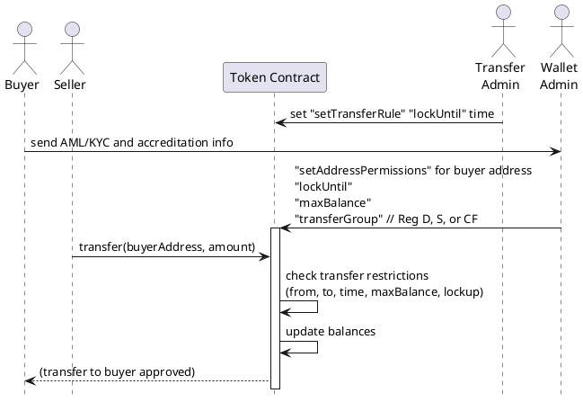
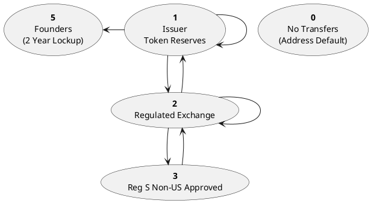

```plantuml
@startuml basic-issuance
actor "Buyer" as Buyer
actor "Seller" as Seller
participant "Token Contract" as Token
actor "Transfer\nAdmin" as TAdmin
actor "Wallet\nAdmin" as WAdmin

TAdmin -> Token: set "setTransferRule" "lockUntil" time
Buyer -> WAdmin: send AML/KYC and accreditation info
WAdmin -> Token: "setAddressPermissions" for buyer address\n"lockUntil"\n"maxBalance"\n"transferGroup" // Reg D, S, or CF
activate Token
Seller -> Token: transfer(buyerAddress, amount)
Token -> Token: check transfer restrictions\n(from, to, time, maxBalance, lockup)
Token -> Token: update balances
Token --> Buyer: (transfer to buyer approved)
hide footbox
@enduml
```

```plantuml
@startuml issuer-transfer-restriction-graph
actor (Default) as "**0**\nNo Transfers\n(Address Default)"
actor (Issuer) as "**1**\nIssuer\nToken Reserves"
actor (Exchange) as "**2**\nRegulated Exchange"
actor (Reg S) as "**3**\nReg S Non-US Approved"
actor (Founders) as "**5**\nFounders\n(2 Year Lockup)"
(Issuer) -> (Issuer)
(Issuer) -down-> (Exchange)
(Issuer) -left-> (Founders)
(Exchange) -down-> (Exchange)
(Exchange) -> (Issuer)
(Exchange) -down-> (Reg S)
(Reg S) -> (Exchange)
@enduml
```