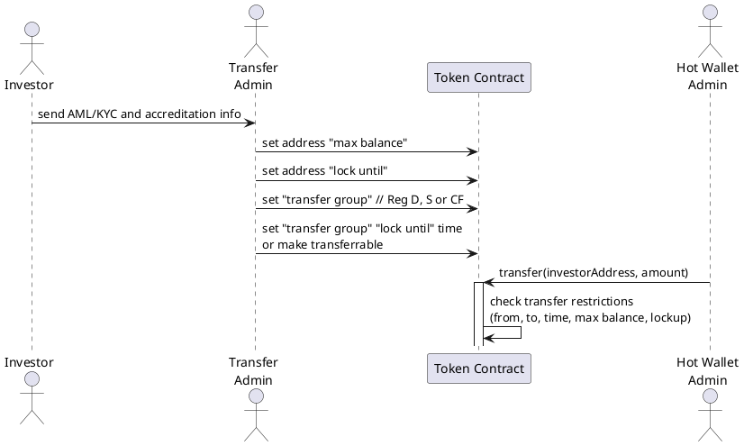
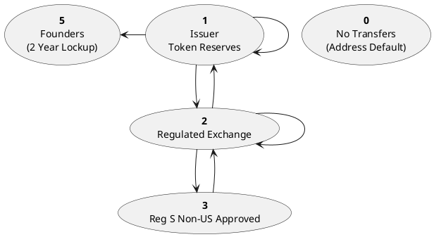

```plantuml
@startuml basic-issuance
actor "Investor" as Investor
actor "Transfer\nAdmin" as TAdmin
participant "Token Contract" as Token
actor "Hot Wallet\nAdmin" as HAdmin

Investor -> TAdmin: send AML/KYC and accreditation info
TAdmin -> Token: set address "max balance"
TAdmin -> Token: set address "lock until" 
TAdmin -> Token: set "transfer group" // Reg D, S or CF
TAdmin -> Token: set "transfer group" "lock until" time\nor make transferrable
HAdmin -> Token: transfer(investorAddress, amount)
activate Token
Token -> Token: check transfer restrictions\n(from, to, time, max balance, lockup)

@enduml
```

```plantuml
@startuml issuer-transfer-restriction-graph
actor (Default) as "**0**\nNo Transfers\n(Address Default)"
actor (Issuer) as "**1**\nIssuer\nToken Reserves"
actor (Exchange) as "**2**\nRegulated Exchange"
actor (Reg S) as "**3**\nReg S Non-US Approved"
actor (Founders) as "**5**\nFounders\n(2 Year Lockup)"
(Issuer) -> (Issuer)
(Issuer) -down-> (Exchange)
(Issuer) -left-> (Founders)
(Exchange) -down-> (Exchange)
(Exchange) -> (Issuer)
(Exchange) -down-> (Reg S)
(Reg S) -> (Exchange)
@enduml
```